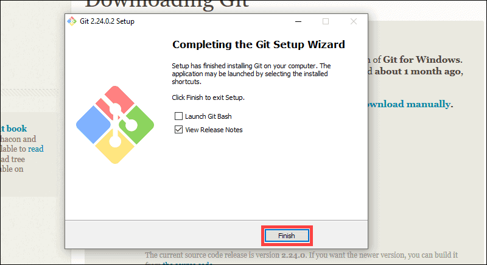

# Complete Beginner's Guide to Git

## Table of Contents
- [Complete Beginner's Guide to Git](#complete-beginners-guide-to-git)
  - [Table of Contents](#table-of-contents)
  - [What is Git?](#what-is-git)
  - [Installation Guide](#installation-guide)
    - [Windows](#windows)
  - [](#)
    - [macOS](#macos)
    - [Linux](#linux)
      - [Ubuntu/Debian:](#ubuntudebian)
      - [Fedora:](#fedora)
      - [Arch Linux:](#arch-linux)
    - [Android](#android)
  - [Additional Tools](#additional-tools)
    - [GitHub CLI](#github-cli)
    - [GitHub Desktop](#github-desktop)
    - [Git in VSCode](#git-in-vscode)
  - [Basic Git Configuration](#basic-git-configuration)
  - [Essential Git Commands](#essential-git-commands)

## What is Git?

Git is a distributed version control system that tracks changes in source code during software development. It allows multiple developers to work together on projects of any size.

## Installation Guide

### Windows

1. Download Git from [git-scm.com](https://git-scm.com/download/windows)

   
2. Run the installer
   
---
<details>
<summary> 💡 Pro Tip: Terminal Choice in Windows</summary>

> During installation, you'll be asked how to use Git from the command line. You can choose between:
> - Git from the Command Prompt (Windows' default terminal)
> - Git from PowerShell
> - Git from Git Bash (a Unix-like terminal emulator)
> 
> While all options work, this guide uses Git Bash as it provides a consistent Unix-like experience and better compatibility with Git-related commands and scripts.

> the installer also adds Git GUI to your system. (but we can do better with GitHub Desktop or VSCode)
> 
</details>

---
3. Verify installation (in your system terminal OR in git terminal OR in PowerShell):
```bash
git --version
```


### macOS
in your expensive Macbook's terminal:
1. Install using Homebrew (recommended):
```bash
# Install Homebrew first if not installed
/bin/bash -c "$(curl -fsSL https://raw.githubusercontent.com/Homebrew/install/HEAD/install.sh)"

# Install Git
brew install git
```

2. Alternative: Install Xcode Command Line Tools:
```bash
xcode-select --install
```

3. Verify installation:
```bash
git --version
```

### Linux
You know where!:
#### Ubuntu/Debian:
```bash
sudo apt update
sudo apt install git
```

#### Fedora:
```bash
sudo dnf install git
```

#### Arch Linux:
```bash
sudo pacman -S git
```

### Android

1. Install Termux from F-Droid store (the version in Play Store is outdated and broken!)
```bash
# Update package list
pkg update

# Install Git
pkg install git
```

## Additional Tools

### GitHub CLI

1. Installation:

**Windows (via scoop):**
```bash
scoop install gh
```

**macOS:**
```bash
brew install gh
```

**Linux:**
```bash
# Ubuntu/Debian
curl -fsSL https://cli.github.com/packages/githubcli-archive-keyring.gpg | sudo dd of=/usr/share/keyrings/githubcli-archive-keyring.gpg
echo "deb [arch=$(dpkg --print-architecture) signed-by=/usr/share/keyrings/githubcli-archive-keyring.gpg] https://cli.github.com/packages stable main" | sudo tee /etc/apt/sources.list.d/github-cli.list
sudo apt update
sudo apt install gh
```

2. Authentication:
```bash
gh auth login
```

### GitHub Desktop
if you fancy a great GUI for git, easy to use and looks good! you get a complete overview of your repository and its branches, commits, and changes. and you can do most of the git operations from the GUI itself.

1. Download from [desktop.github.com](https://desktop.github.com)


### Git in VSCode

Vscode is a popular code editor, and it comes with Git integration out of the box. you can do most of the git operations from the editor itself.

---
<details>
<summary> 💡 Pro Tip: what should I use??</summary>

> This, in my opinion, is the best option for beginners, as you can see the changes you made in the code and the changes you made in the git in the same window. PICK THIS! -- Sal
</details>

---

1. VSCode comes with Git integration
2. Install recommended extensions:
   - GitLens
   - Git History
   - Git Graph


## Basic Git Configuration

Set up your identity:
```bash
git config --global user.name "Your Name"
git config --global user.email "your.email@example.com"
```

Set default branch name:
```bash
git config --global init.defaultBranch main
```

Set default editor:
```bash
git config --global core.editor "code --wait"  # For VSCode
```

## Essential Git Commands

Initialize a repository:
```bash
git init
```

Clone a repository:
```bash
git clone <repository-url>
```

Basic workflow:
```bash
# Check status
git status

# Stage changes
git add <file>
git add .  # Stage all changes

# Commit changes
git commit -m "Descriptive message"

# Push changes
git push origin main

# Pull changes
git pull origin main
```

Branch operations:
```bash
# Create branch
git branch <branch-name>

# Switch branch
git checkout <branch-name>
# or
git switch <branch-name>  # Modern Git

# Create and switch in one command
git checkout -b <branch-name>
```

View history:
```bash
git log
git log --oneline  # Compact view
```
