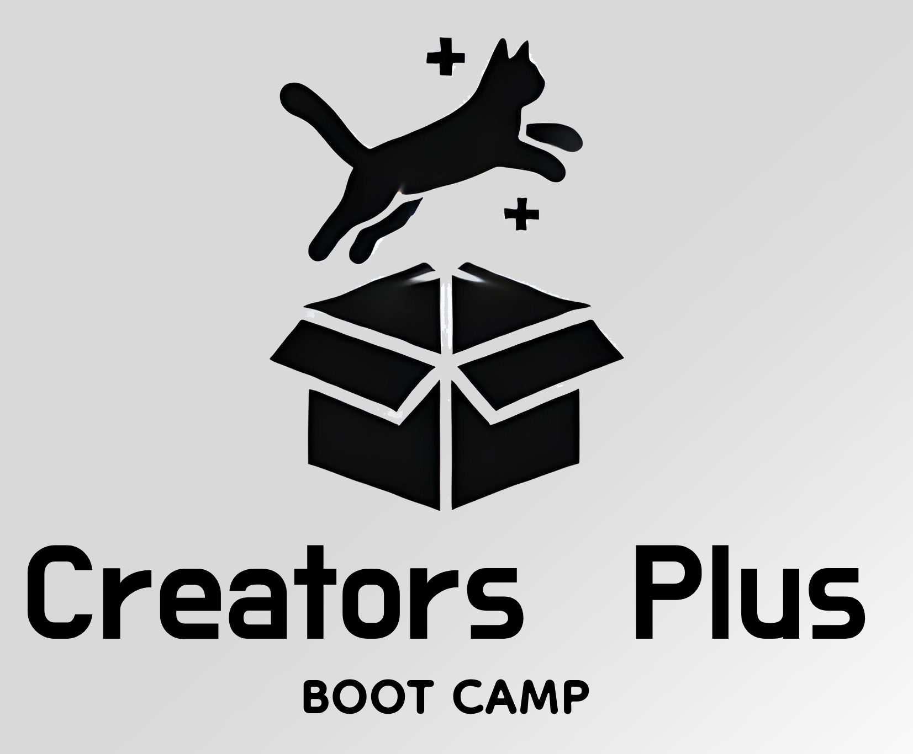

# Creators Camp

Welcome to Creators Camp! We're excited to have you on board and look forward to learning and growing together. This comprehensive program is designed to help you master TypeScript through hands-on learning and practical projects.

## 📚 Course Structure

### TypeScript Essential Training
- [Week 1: TypeScript Fundamentals](Docs/course/week-1/README.md)
  - Basic Types and Concepts
  - Functions and Interfaces
  - Classes and Error Handling
  - Project: Command-Line Calculator

- [Week 2: Browser and DOM Integration](Docs/course/week-2/README.md)
  - DOM Manipulation
  - Event Handling
  - Async Operations
  - Project: Interactive Todo Application

## Getting Started

### Entry Exam
Before beginning the course, please complete the entry exam with your instructor. This helps us:
- Understand your current skill level
- Tailor the program to your needs
- Identify areas for focused attention

#### Resources
- [Entry Exam Walkthrough](Docs/entry-exam-wt.md)
  - Practice questions similar to the actual test
  - Core concept explanations
  - Preparation guidelines

## 🗓️ Daily Schedule

### Daily Stand-ups
- Morning meetings to review goals
- Set priorities for the day
- Connect with peers and instructors
- Address questions and challenges

### Support Structure
- Comprehensive resources and walkthroughs
- Direct access to instructors
- Peer learning opportunities
- Regular feedback sessions

### Weekly Projects
- Friday project assignments
- Weekend practice time
- Real-world application of concepts
- Instructor feedback and guidance

## 🔧 Tools and Resources

### Development Environment
- TypeScript setup guides
- Recommended IDE configurations
- Required dependencies
- Best practices documentation

### Support Channels
- Course repository for questions
- Technical discussion forums
- Resource sharing platform
- Peer collaboration spaces

## 💡 Tips for Success
1. Attend all daily stand-ups
2. Complete practice exercises
3. Participate in discussions
4. Work on weekend projects
5. Ask questions when needed

## 📞 Need Help?
Feel free to reach out through:
- Course discussion channels
- Direct instructor messages
- Technical support forum
- Peer study groups

---

*We're committed to making this a great learning experience for everyone. Welcome to Creators Camp!* 🚀